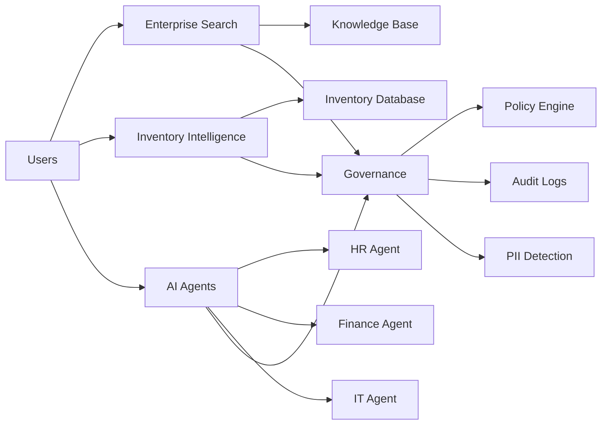

# Enterprise AI Architecture

```mermaid
flowchart LR

A[Users]

A --> B[Enterprise Search]

A --> C[Inventory Intelligence]

A --> D[AI Agents]

B --> E[Knowledge Base]

C --> F[Inventory Database]

D --> G[HR Agent]
D --> H[Finance Agent]
D --> I[IT Agent]

B --> J[Governance]
C --> J
D --> J

J --> K[Policy Engine]
J --> L[Audit Logs]
J --> M[PII Detection]
```